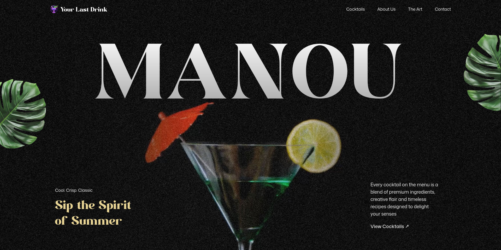
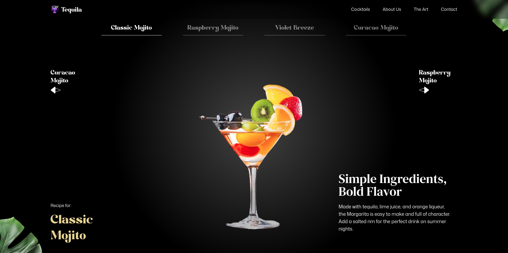
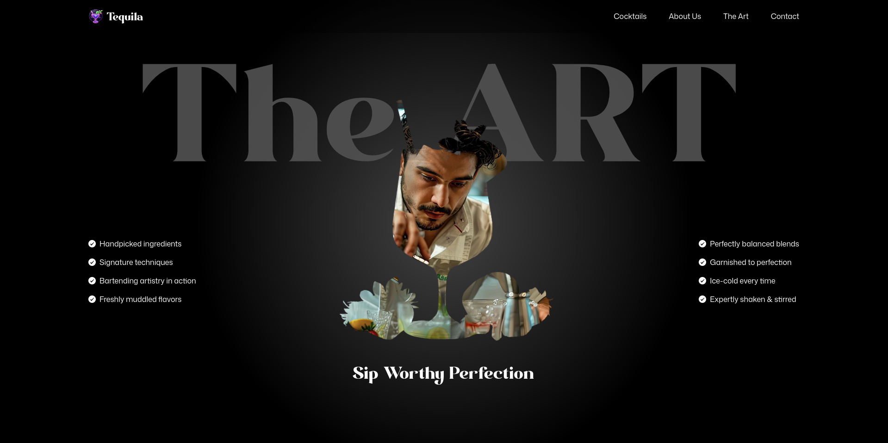

# Tequila Website

A modern, animated Tequila-themed website built using **React**, **Tailwind CSS**, and **GSAP**. This project showcases smooth scroll-based animations, clean UI components, and a premium brand aesthetic.

## 🚀 Technologies Used

- **React** – Component-based UI structure
- **Tailwind CSS** – Utility-first styling
- **GSAP** – Animations and scroll interactions
- **GSAP ScrollTrigger & SplitText** – Triggered animations and text splitting effects

## 📁 Project Structure

```
src/
 ├── components/
 │    ├── Navbar.jsx
 │    ├── Hero.jsx
 │    ├── Cocktails.jsx
 │    ├── About.jsx
 │    ├── Art.jsx
 │    ├── Menu.jsx
 │    └── Contact.jsx
 ├── App.jsx
 └── main.jsx
 └── index.css
```

## 🖼️ Screenshots

_Add your screenshots in the `assets/` folder and reference them below. Replace placeholders when ready._

### Hero Section



### Cocktails Section



### Art Section



## 🎨 Features

- Smooth scroll-triggered animations
- Split text animations for headings
- Fully responsive layout via Tailwind
- Animated hero section
- Clean navigation bar
- Custom imagery and branding aesthetics

## 📦 Installation & Setup

```bash
# Clone the repository
git clone https://github.com/your-username/your-repo.git

# Navigate to project folder
cd your-repo

# Install dependencies
npm install

# Start development server
npm start
```

## 🔧 Build for Production

```bash
npm run build
```

## 🤝 Contributing

Pull requests are welcome! For major changes, please open an issue first.

## 📄 License

This project is licensed under the MIT License.
